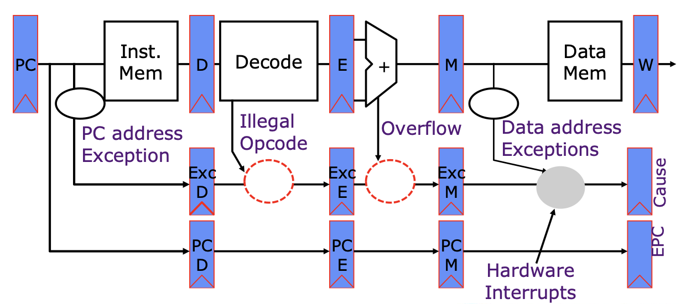

## Repo For the Coursework of BUAA Computer Organization 2018

### Basic Information

- **Author**: Zinuo You
- **Course Grade**: 100/100
- **Evaluation**: Independent Development, Black Box Test + Q&A
- **Coding Language**: Verilog, MIPS32, Python (for auto test)
- **Software**: Xilinx ISE, MARS (MIPS32 assemble simulator), Logisim (interactive circuits simulator)
- **Reference: ** The course is developed  on [UC Berkeley CS152 Computer Architecture and Engineering](https://inst.eecs.berkeley.edu/~cs152/sp20/)
- **Guide Book**
  - [BUAA CS Core MOOC](http://cscore.net.cn)
  - [See MIPS Run Linux](See-Mips-Run-Linux.pdf)

### Project Introduction

#### P0

- **Target**: Warm up for computational structure. Build basic combinational and sequential circuits with gate circuits. 
- **Software:** Logisim

#### P1

- **Target**: Warm up for implementing circuits with Verilog. 
- **Software and Coding Language:** Xilinx ISE; Verilog

#### P2

- **Target**: Warm up for MIPS. Implement algorithms with assemble languages or translate C program to assemble program. 
- **Software and Coding Languages:** MARS; MIPS32

#### P3

- **Target**: Design and build a **single-cycle CPU** supporting **7** basic MIPS instructions **in an interactive form**. 
- **Software:** Logisim, MARS; MIPS32
- **Report:** [P3-CPU-Report(Chinese)](p3/P3-CPU-Report.pdf)

#### P4

- **Target**: 
  - Design and build a **single-cycle CPU** supporting **7** basic MIPS instructions **in an abstract and coding form**.
- **Software and Languages:** Xilinx ISE, MARS; Verilog, MIPS32
- **Report:** [P4-CPU-Report(Chinese)](p4/P4-CPU-Report.pdf)
- 

#### P5

- **Target**: 
  - Design and build a **5-level pipeline CPU** supporting **7** basic MIPS instructions with **full forward and minimum hold**. 
- **Software and Languages:** Xilinx ISE, MARS; Verilog, MIPS32
- **Report:** [P5-CPU-Report(Chinese)](p5/P5-CPU-Report.pdf)
- 

#### P6

- **Target**: 
  - Design and build a **5-level pipeline CPU** supporting **50** MIPS instructions with **full forward and minimum hold**. 
  - Development with engineering methods, which enables swift adjustments under new requirements. 
- **Software and Languages:** Xilinx ISE, MARS; Verilog, MIPS32
- **Report:** [P6-CPU-Report(Chinese)](p6/P6-CPU-Report.pdf)

#### P7

- **Target**: 
  - Design and build a **pipeline CPU** with **CP0**, supporting **54** MIPS instructions and **inner and outer exceptions**. 
  - Implement a **micro system hardware** with CPU, system bridge, drivers and timers. 
- **Software and Languages:** Xilinx ISE, MARS; Verilog, MIPS32
- **Report:** [P7-CPU-Report(Chinese)](p7/P7-CPU-Report.pdf)
- 

#### P8

- **Target**: 
  - Design and build on **FPGA** a **pipeline CPU** supporting **53** MIPS instructions and **inner and outer exceptions**. 
  - Implement on **FPGA** a **micro system hardware** with CPU, system bridge, drivers and devices. 
  - Implement the **micro system software** with assemble languages to run tasks such as arithmetic, timing and message echo. 
- **Software and Languages:** Xilinx ISE, MARS; Verilog, MIPS32
- **Report:** 
  - [P8-CPU-Report(Chinese)](p8/P8-CPU-Report.pdf)
  - [P8-OS-Report(Chinese)](p8/P8-OS-Report.pdf)
- 

### Appendix

#### Supported MIPS32 Instructions

#### Data Path of P8 CPU

#### Rules for Hold and Forward in Pipeline CPU (Tuse/Tnew)

| IF/ID |         |      | ID/EX(Tnew) | EX/MEM    | MEM/WB  |            |            |           |            |           |           |         |           |           |           |            |                  |
| ----- | ------- | ---- | ----------- | --------- | ------- | ---------- | ---------- | --------- | ---------- | --------- | --------- | ------- | --------- | --------- | :-------: | ---------- | ---------------- |
| Type  | Src Reg | Tuse | calr/rd/1   | cali/rt/1 | ld/rt/2 | jal/$31/1  | jalr/rd/1  | mfc0/rt/2 | mtc0/epc/2 | calr/rd/0 | cali/rt/0 | ld/rt/1 | jal/$31/0 | jalr/rd/0 | mfc0/rt/1 | mtc0/epc/1 | Stall_Impossible |
| calr  | rs/rt   | 1    |             |           | STOP    |            |            | STOP      |            |           |           |         |           |           |           |            |                  |
| cali  | rs      | 1    |             |           | STOP    |            |            | STOP      |            |           |           |         |           |           |           |            |                  |
| ld    | rs      | 1    |             |           | STOP    |            |            | STOP      |            |           |           |         |           |           |           |            |                  |
| st    | rs      | 1    |             |           | STOP    |            |            | STOP      |            |           |           |         |           |           |           |            |                  |
| st    | rt      | 2    |             |           |         |            |            |           |            |           |           |         |           |           |           |            |                  |
| btype | rs/rt   | 0    | STOP        | STOP      | STOP    | Impossible | Impossible | STOP      |            |           |           | STOP    |           |           |   STOP    |            |                  |
| jr    | rs      | 0    | STOP        | STOP      | STOP    | Impossible | Impossible | STOP      |            |           |           | STOP    |           |           |   STOP    |            |                  |
| jalr  | rs      | 0    | STOP        | STOP      | STOP    | Impossible | Impossible | STOP      |            |           |           | STOP    |           |           |   STOP    |            |                  |
| mtc0  | rt      | 2    |             |           |         |            |            |           |            |           |           |         |           |           |           |            |                  |
| eret  |         |      |             |           |         |            |            |           | STOP       |           |           |         |           |           |           | STOP       |                  |

#### Supported Exceptions of P8 CPU

